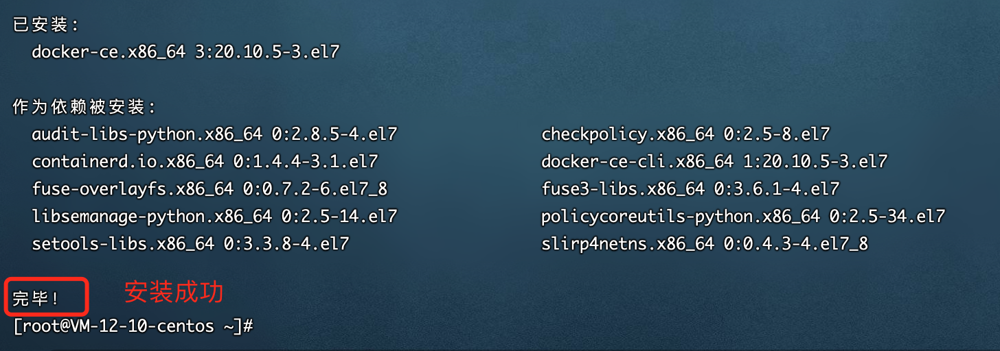

# 运维和部署

## Docker安装

参考链接：https://cloud.tencent.com/developer/article/1151214

1、卸载Docker

Docker的旧版本被称为`docker`或`docker-engine`。 如果安装了这些，请卸载它们以及关联的依赖关系。

```shell
sudo yum remove docker \
                  docker-client \
                  docker-client-latest \
                  docker-common \
                  docker-latest \
                  docker-latest-logrotate \
                  docker-logrotate \
                  docker-selinux \
                  docker-engine-selinux \
                  docker-engine
```

2、存储库安装，安装必须的包

您可以根据需要以不同的方式安装Docker CE：

- 大多数用户设置了Docker的存储库并从中安装，以方便安装和升级任务。 这是推荐的方法。
- 某些用户下载RPM软件包并手动安装并手动管理升级。 这在诸如在没有访问互联网的空隙系统上安装Docker的情况下是有用的。
- 在测试和开发环境中，一些用户选择使用自动化便利脚本来安装Docker。

安装必须的包。yum-utils提供了yum-config-manager实用程序，并且device-mapper-persistent-data和lvm2需要devicemapper存储驱动程序。

```she
sudo yum install -y yum-utils \
  device-mapper-persistent-data \
  lvm2
```




# 安装mysql

https://www.runoob.com/docker/docker-install-mysql.html

```shell
# 首次启动
docker run -itd --name mysql-aquaman -p 3686:3306 -e MYSQL_ROOT_PASSWORD=gN3pK0eH0dE1 mysql:5.7docker 
# 启动
docker run -itd --name mysql-aquaman -p 3686:3306 mysql:5.7
```

安装成功后，进入容器，配置。

```shell
# 进入容器
docker exec -it 容器ID /bin/bash
# 登录mysql 
mysql -uroot -p
# 切换到mysql数据库
use mysql;
# 查看user表信息
select host,user from mysql.user;
# 创建用户
# 创建数据库
```


# 安装Redis

https://cloud.tencent.com/developer/article/1562815

docker run -p 9376:6379 -v /data/redis:/data --name redis -d --restart=always redis:6.2 redis-server --appendonly yes --requirepass "8f77wMb6wHLepCs" 


# 安装Mongodb

https://cloud.tencent.com/developer/article/1630512

docker run -p 26178:27017 -v /data/mongo:/data/db --name mongodb -d mongo:4.4

docker cp mongodb:/etc/mongod.conf .

# 安装Nacos

